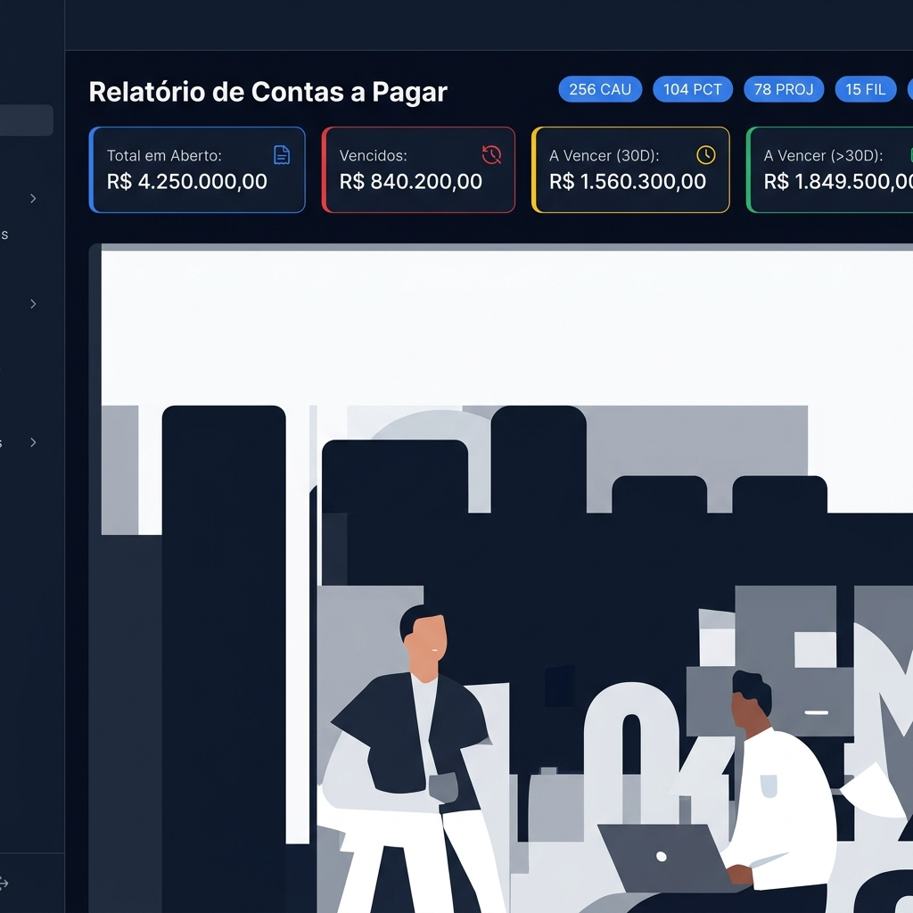

# Sienge Cost Dashboard 🏗️📊

Este projeto automatiza a extração de dados de relatórios de **Contas a Pagar** do ERP Sienge (PDF) e os transforma em um dashboard interativo, visual e moderno.

## 🖼️ Preview
Abaixo, uma visão geral da interface gerada automaticamente a partir do processamento dos relatórios:



## 📌 Funcionalidades
- **Extração Automática**: Script Python que processa múltiplos PDFs do Sienge e consolida em JSON.
- **Interface Interativa**: Dashboard web (HTML/JS) com filtros por obra, mês, ano e tipo de documento.
- **Análise Financeira**: KPIs automáticos de valores vencidos, a vencer (30 dias) e totais.
- **Gráficos Dinâmicos**: Visualização do fluxo de desembolso mensal.
- **Exportação para Excel**: Gere planilhas detalhadas a partir dos dados filtrados no dashboard.

## 🚀 Como Usar

### 1. Instalação
Acesse a pasta do projeto e instale as dependências:
```bash
pip install -r requirements.txt
```

### 2. Extração de Dados
1. Coloque seus relatórios PDF do Sienge na mesma pasta dos scripts.
2. Execute o script de extração:
```bash
python extrair_pdf_para_dashboard.py
```
Isso gerará o arquivo `dados_atualizados.json` necessário para o funcionamento do dashboard.

### 3. Executando o Dashboard
Execute o servidor local para abrir o dashboard no seu navegador:
```bash
python abrir_dashboard.py
```

## 🛡️ Segurança e Privacidade
Este projeto roda localmente. **Nenhum dado é enviado para servidores externos.** O processamento é feito inteiramente na sua máquina. O arquivo `.gitignore` já está configurado para não subir seus PDFs originais.

## 📄 Licença
Este projeto está sob a licença MIT. 
